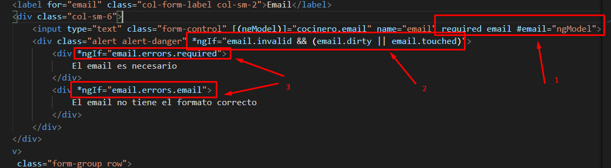
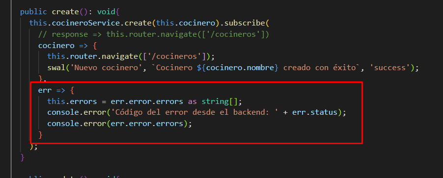

## Creación del Modelo backend

1. Creación de Entidades.
2. Establecer validaciones para los campos de las entidades.
3. Relacionar entidades.
4. Creación de Repositorio y Servicios.
5. Creación del controlador.
6. Captura de errores y envío en la respuesta. Uso de ResponseEntity.
7. Validación de datos de creación / modificación. Uso de anotaciones de validación en entidades (javax.validation). Anotación @Valid e inyección de objeto contenedor de errores BindingResult en controlador.
8. Paginación con objeto Pageable

## Creación del modelo en Angular

1. Creación de los componentes.
2. Creación de las entidades y servicios para las entidades.
3. Enrutamiento entre componentes. (Route, ActivateRoute)
4. Creación de formulario para creación de entidades.
5. Recoger errores del front. Uso de catchError de rxjs/operators.
6. Validaciones en formulario (required, maxlength). Uso de ngModel como objeto contenedor de los mensajes de error.  
    6.1. Validación de campos de formulario

    6.2. Desactivación de botón de formulario

7. Manejar errores recibidos desde el backend. Uso de catchErrors:  
    i. En servicio comprobar el status de la respuesta, si es una bad request añadir errores recibidos
    
    ii. En componente de formulario añadir array con los errores
    
    iii. En vista de formulario añadir lista listando los errores, y desactivar el control de errores de campo de angular.
    
    
8. Formatear valores recibidos desde el back en la vista. Configuración del locale de manera Global  
    i. Formateo de fechas
    
    
    
    
    ii. Configuración en el appModule
    
    
9. Paginación
    1. Cambio a objeto retonado tipo Observable<any>
    
    
    
    